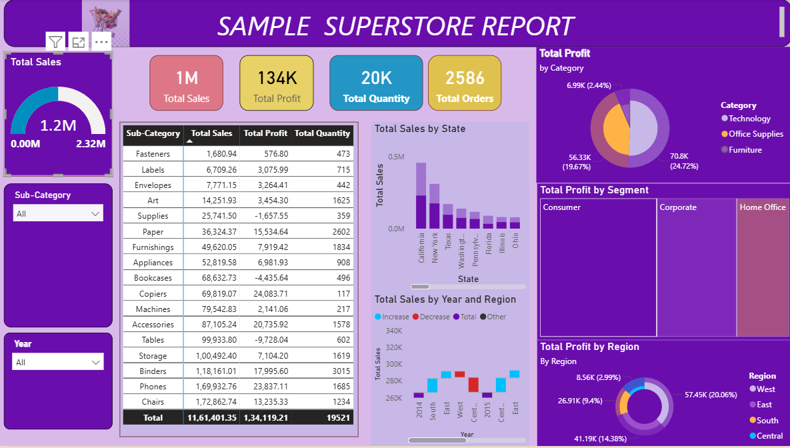

# Sample Superstore Sales & Profitability Dashboard

## 📊 Project Overview
This project is an interactive Power BI dashboard built on the Sample Superstore dataset (9,994 orders, 2016–2019), analyzing sales performance, profitability, and order trends across regions, states, categories, and sub-categories. The goal was to uncover which product lines and regions drive profit — and which ones are losing money — to support data-driven business decisions.

## 🎯 Objective
- Track overall sales, profit, quantity, and order volume in one view
- Identify underperforming sub-categories and states with negative profit
- Compare sales and profit trends across states, regions, and years
- Break down profitability by customer segment (Consumer, Corporate, Home Office)

## 🛠️ Tools & Skills Used
- **Power BI Desktop** – dashboard design and data modeling
- **DAX (Data Analysis Expressions)** – custom measures and calculations
- **Power Query** – data cleaning and transformation
- **Data Visualization** – KPI cards, donut charts, bar charts, matrix tables, slicers

## 📈 Key Insights
- Analyzed **$2.3M in total sales** generating **$286K in profit** across **5,009 orders** and **~37,900 units** sold
- **Furniture** is the weakest-performing category with only a **2.5% profit margin**, compared to **17%+ margins** in Office Supplies and Technology
- **Tables** ($-17.7K) and **Bookcases** ($-3.5K) are the two biggest loss-making sub-categories
- **Texas, Ohio, Pennsylvania, and Illinois** are the top 4 states by losses, together losing over **$70K in profit**, while **California and New York** are the strongest contributors (**$76K and $74K**)
- Discounting shows a **negative correlation with profit** (-0.22), suggesting discount policy needs review
- **Consumer** segment drives the most profit ($134K), followed by Corporate ($92K) and Home Office ($60K)

## 📷 Dashboard Preview

## 📁 Files in this Repository
- `powerbi@samplesuperstore.pbix` – the full interactive Power BI file
- `powerbi@samplesuperstore_report.png` – static preview image of the report

## 🔍 How to Use
1. Download the `.pbix` file
2. Open it in **Power BI Desktop** (free download from Microsoft)
3. Use the slicers (Sub-Category, Year) to filter and explore the data interactively

## 👤 About Me
Healthcare professional transitioning into Business Analysis & Data Analytics, with a background in clinical operations and medical coding. This project reflects my growing skills in data visualization, DAX, and translating raw data into actionable business insights.

[LinkedIn](https://www.linkedin.com/in/aswanijayakumar/) | [Resume](#)
